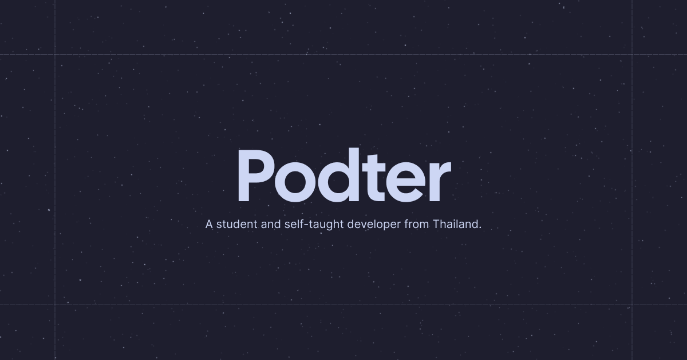

# podter.me



[](https://skillicons.dev)

[](https://podter.me/)

Podter's Website. Built with Next.js app router, shadcn/ui, Auth.js, Cloudflare D1, Cloudflare KV and deployed to Cloudflare Pages.

https://podter.me/

## Getting Started

First, run the development server:

```bash
npm run dev
# or
yarn dev
# or
pnpm dev
```

Open [http://localhost:3000](http://localhost:3000) with your browser to see the result.

## License

This project is licensed under the MIT license. See the [LICENSE](LICENSE) file for more information.

Please remove all of my personal information (blog posts, images, etc.) before using this project for your own purposes.
