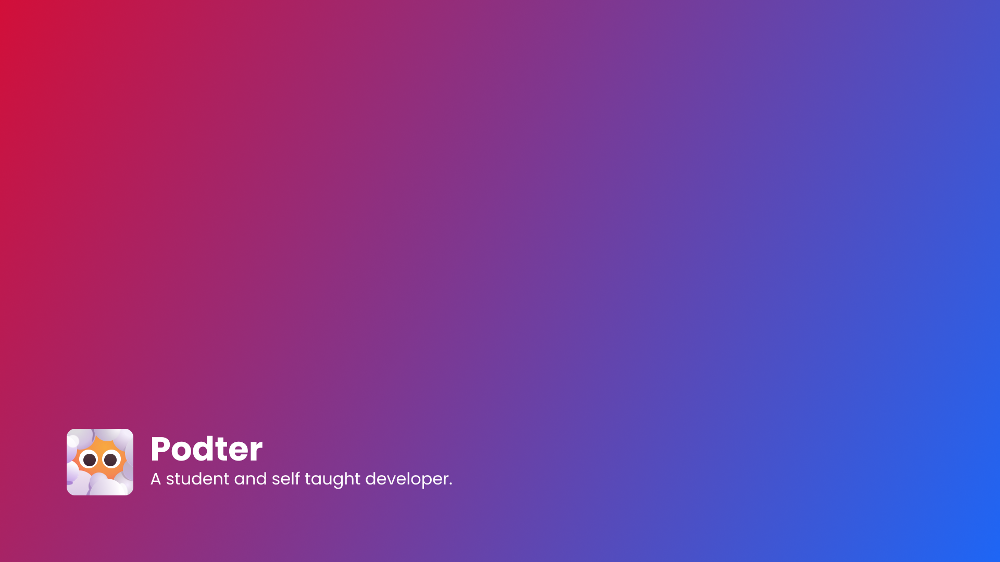

# podter.xyz



Podter's Website. Built with Next.js, Tailwind CSS, daisyUI, PlanetScale and deployed using Vercel.

https://podter.xyz/

## Getting Started

First, run the development server:

```bash
npm run dev
# or
yarn dev
# or
pnpm dev
```

Open [http://localhost:3000](http://localhost:3000) with your browser to see the result.

## License

This project is licensed under the MIT license. See the [LICENSE](LICENSE) file for more information.
