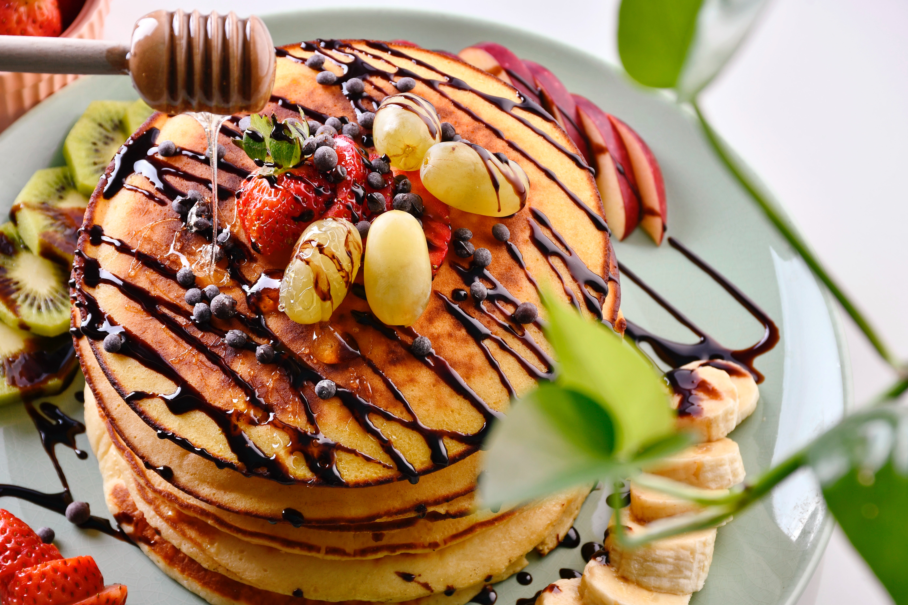
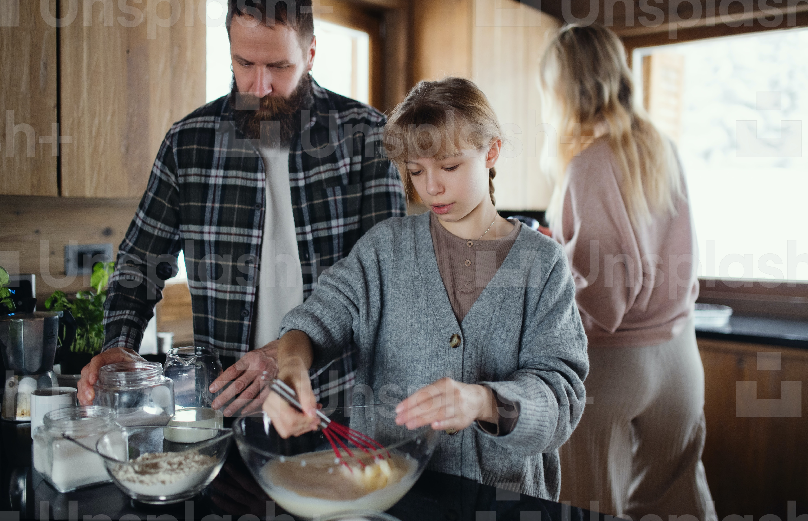

Hello, It's ~~Podter~~ CodeAI here! I'm going to teach you how to make a Perfect Pancake.
After I teaching all people coding in a Discord server, I feel hungry so I'm going to make my favorite breakfast.

Perfect pancakes are easier to make than you think.
This pancake recipe produces thick, fluffy, and all-around delicious pancakes with just a few ingredients
that are probably already in your kitchen (and it's so much better than the boxed stuff).

> This is a joke between me (Podter) and [my friend (Voxeliorn)](https://voxeliorn1.vercel.app/), the creator of CodeAI Discord bot.
> He usually tell people how to code but he is a good chef too! So we asked him to write a pancake recipe in markdown.

## Ingredients

- 1.5 cups of flour
- 2 tbsp of sugar
- 1.5 tsp of baking powder
- 0.5 tsp of salt
- 1.25 cups of milk
- 1 egg
- 3 tbsp of butter

## Instructions

1. In a large bowl, whisk the flour, sugar, baking powder, and salt together.
2. In a separate bowl, whisk the milk, egg, and melted butter together.
3. Pour the wet ingredients into the dry ingredients and stir until combined.
4. Heat a lightly oiled griddle or frying pan over medium-high heat.
5. Scoop 1/4 cup of batter onto the griddle for each pancake.
6. Cook until bubbles form on the surface of the pancake, then flip and cook for an additional minute.

Enjoy your pancakes! :)

